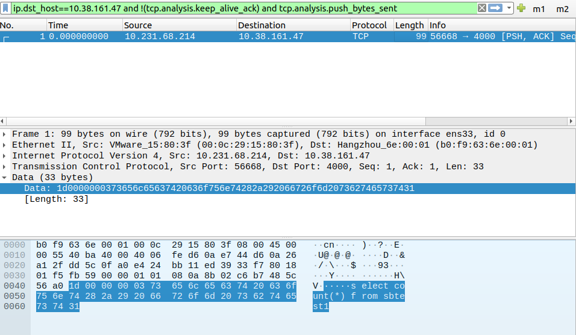

## Weir中发现的问题分享

> 目前共发现 ==6== 处问题，其中 ==3== 处为较为严重的 Bug，另 ==3== 处为功能实现不完善

#### Mysql报文

根据 [mysql传输协议](https://dev.mysql.com/doc/internals/en/mysql-packet.html)，我们使用 TCP/IP 向 mysql server 发送指令的报文格式为：

**Data = Header + SequenceID + Payload**

其中，Header 固定为 4byte，第一个 byte 为后续部分的长度；SequenceID 则代表本次报文的指令类型；Payload 为我们发送的指令本身。这里列举几个常见的 SequenceID（[点这里看详细版](https://dev.mysql.com/doc/internals/en/command-phase.html)）：

| Hex  | 常量名           | 备注                                               |
| ---- | :--------------- | :------------------------------------------------- |
| 0x01 | COM_QUIT         |                                                    |
| 0x02 | COM_INIT_DB      | 对应use指令                                        |
| 0x03 | COM_QUERY        | 这个最常用，包括client中的增删查改等指令           |
| 0x05 | COM_CREATE_DB    | 对应create database指令                            |
| 0x0e | COM_PING         |                                                    |
| 0x16 | COM_STMT_PREPARE | 对应mysqld_stmt_prepare() 内部调用，sysbench所使用 |
| 0x17 | COM_STMT_EXECUTE | 对应mysqld_stmt_execute() 内部调用，sysbench所使用 |

```shell
# 举个例子
mysql> select count(*) from sbtest1;
```



可以看出，Header 部分对应 `1d 00 00 00`，其中 `1d` 为后续部分的长度；SequenceID 部分对应 `03`，代表 `COM_QUERY` 指令；Payload 部分则为我们输入的指令的具体内容。

***

#### 较严重的Bug

1. 指令为 COM_STMT_EXECUTE 时，在状态机后会执行 [[proxy/backend/client/stmt.go +237]](https://github.com/tidb-incubator/weir/blob/master/pkg/proxy/backend/client/stmt.go) `StmtExecuteForward() ` 函数。这里错误地将writeData填成了data

   ```go
   func (c *Conn) StmtExecuteForward(data []byte) (*Result, error) {
   	writeData := make([]byte, 4, len(data)+5)
   	writeData = append(writeData, COM_STMT_EXECUTE)
   	writeData = append(writeData, data...)
   	c.ResetSequence()
   	if err := c.WritePacket(data); err != nil {
   		return nil, errors.Trace(err)
   	}
   	return c.readResult(true)
   }
   ```

2. 修复上述 Bug 并成功发送正确报文后，在 [[proxy/server/conn_stmt.go +89]](https://github.com/tidb-incubator/weir/blob/master/pkg/proxy/server/conn_stmt.go) `handleStmtExecute()` 函数解析返回数据。这里做空判断的对象应该是 ret.Resultset 而不是 ret。

   ```go
   // update: Status = 2, InsertId = 0, AffectedRows = 1
   // select: Status = 2, InsertId = 0, AffectedRows = 0, resultset = {...}
   
   type Result struct {
   	Status uint16
   	InsertId     uint64
   	AffectedRows uint64
   	*Resultset // fields, values, rowDatas
   }
   
   func (cc *clientConn) handleStmtExecute(ctx context.Context, data []byte) error {
   	...
       
   	ret, err := cc.ctx.StmtExecuteForward(ctx, int(stmtID), data)
   	if err != nil {
   		return err
   	}
   
   	if ret != nil {
   		err = cc.writeGoMySQLResultset(ctx, ret.Resultset, true, ret.Status, 0)
   	} else {
   		err = cc.writeOK()
   	}
   	return err
   }
   ```

   同理，[[proxy/server/conn_query.go +156]](https://github.com/tidb-incubator/weir/blob/master/pkg/proxy/server/conn_query.go) `handleQuery()` 函数也可能有同样问题

3. 连接 Weir 时没有进行密码的检验（对应的函数没有被调用）

   解决办法：在 [[proxy/namespace/manager.go +65]](https://github.com/tidb-incubator/weir/blob/master/pkg/proxy/namespace/manager.go) `Auth()` 函数处添加对应调用

   ```go
   func (n *NamespaceManager) Auth(username string, pwd, salt []byte) (driver.Namespace, bool) {
   	nsName, ok := n.getNamespaceByUsername(username)
   	if !ok {
   		return nil, false
   	}
   
   	wrapper := &NamespaceWrapper{
   		nsmgr: n,
   		name:  nsName,
   	}
   
   	// return wrapper, true
       return wrapper, wrapper.mustGetCurrentNamespace().Auth(username, pwd, salt)
   }
   ```

***

#### 功能实现不完善

1. namespace 级别配置 `DeniedIPs` 没有实际作用（对应的属性没有被使用）

   解决办法：模仿 `IsDatabaseAllowed()` 函数即可。新增函数最终在 [[proxy/driver/queryctx.go +253]](https://github.com/tidb-incubator/weir/blob/master/pkg/proxy/driver/queryctx.go) 处被调用

   ```go
   func (q *QueryCtxImpl) Auth(user *auth.UserIdentity, pwd []byte, salt []byte) bool {
       ns, ok := q.nsmgr.Auth(user.Username, pwd, salt)
       // if !ok {...}
   	if !ok || ns.IsDeniedHost(user.Hostname){
   		return false
   	}
   	q.ns = ns
   	q.initAttachedConnHolder()
   	q.ns.IncrConnCount()
   	return true
   }
   ```
   
1. 指令为 COM_QUERY 时，不支持  prepare / execute 语句（连接的绑定）以及用户变量的 set 语句

1. 限流 / 熔断的 scope 为 table 时，将 sql 的 from 关键字后面的第一个表当作驱动表

   ```go
   // Execute解析并执行sql语句
   func (q *QueryCtxImpl) Execute(ctx context.Context, sql string) (*gomysql.Result, error) {
   	charsetInfo, collation := q.sessionVars.GetCharsetInfo()
   	stmt, err := q.parser.ParseOneStmt(sql, charsetInfo, collation)
   
   	tableName := wast.ExtractFirstTableNameFromStmt(stmt)
   	ctx = wast.CtxWithAstTableName(ctx, tableName)
   
       //...
       
   	if rateLimitKey, ok := q.getRateLimiterKey(ctx, q.ns.GetRateLimiter()); ok && rateLimitKey != "" {
   		if err := q.ns.GetRateLimiter().Limit(ctx, rateLimitKey); err != nil {
   			return nil, err
   		}
   	}
   	return q.executeWithBreakerInterceptor(ctx, stmt, sql, sqlDigest)
   }
   
   // getRateLimiterKey通过配置文件中的scope与cont获取对应key
   func (q *QueryCtxImpl) getRateLimiterKey(ctx context.Context, rateLimiter RateLimiter) (string, bool) {
   	switch rateLimiter.Scope() {
   	case "namespace":
   		return q.ns.Name(), true
   	case "db":
   		return q.currentDB, true
   	case "table":
   		firstTableName, _ := wast.GetAstTableNameFromCtx(ctx)
   		return firstTableName, true
   	default:
   		return "", false
   	}
   }
   ```

   

