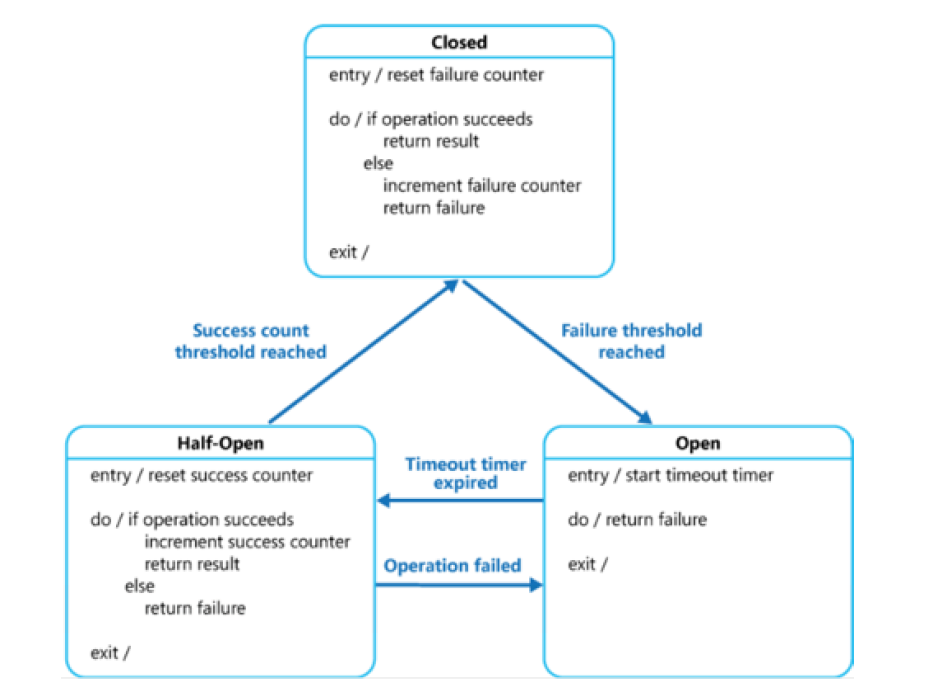

## Weir源码阅读

#### 熔断器

> 相关代码：
>
> `util/rate_limit_breaker/ -> circuit_breaker.go & sliding_window.go` 
>
> `proxy/namespace/breaker.go`

熔断器本质上是一个具有三个状态（关闭、开启、半开启）的状态机，由 **Status**、**Config**、**SlidingWindow**、**Mutex** 四个部分组成，具体定义如下：

```go
type CircuitBreakerConfig struct {
	minQPS               int64 // 触发熔断的最小QPS
    failureNumThreshold  int64 // 每个统计周期内触发熔断的错误数量，为零时表示使用错误率替代
    failureRateThreshold int64 // 触发熔断的错误率(百分比)
	OpenStatusDurationMs int64 // 熔断开启状态持续时间
    // 统计周期时间 = size * cellIntervalMs
	size                 int64 // 统计周期内的单元数量，默认为10
	cellIntervalMs       int64 // 每个单元（时间片）的时长，默认为1000ms
    ...
}

type CircuitBreaker struct {
    status int32 // current status
    config CircuitBreakerConfig
	sw *SlidingWindow
    mu *sync.Mutex    // guard status, config, sw
    ...
}
```

讲熔断器之前先讲一下滑动窗口 SlidingWindow：

滑动窗口的核心思路是使用一组 Cell 来对统计周期进行**分片**（有点像 Weir 同样使用到的 TimeWheel 时间轮），每个 Cell 维护一个 `"total" / "failure" -> int` 的 Map，记录对应的时间片内执行任务的总次数 / 失败次数（时间片大小默认为1s，这样的话统计的就是 QPS 和 err / s 了）。熔断器每次执行任务（这称为一次 `Hit`），无论成功与否，都会**更新滑动窗口**并进行**状态迁移的判断**，具体操作如下：

* 更新滑动窗口（仅当前状态为 `Closed` 时执行）：

  设当前时间为 `nowMs`，令 `cells[(nowMs / cellIntervalMs) % size]` 对应的 Cell 的 total / failure 计数加一

* 判断状态迁移：

  状态机共有三种状态 `Closed`、`Open`、`HalfOpen`

  默认情况下初始状态为 `Closed`，当 failureNum 或 failureRate 达到阈值，且当前 QPS 至少达到 minQPS 时会切换为 `Open` 状态；在 `Open` 状态下，客户端的所有 sql 请求都会返回错误，而不会打到后端的 TiDB cluster，`Open` 状态经过 `OpenStatusDurationMs` 时间后会切换为 `HalfOpen` 状态；`HalfOpen` 状态会判断下一次任务的执行情况，如果成功则切换为 `Closed` 状态，反之则为 `Open` 状态。

  

  三种状态中，只有 `Closed` 状态的判断较为复杂，所以用代码演示一下：

  ```go
  // Hit 根据当前请求的成败isFauilure来驱动CircuitBreaker的状态迁移
  func (cb *CircuitBreaker) Hit(nowMs int64, isFailure bool) {
      switch cb.status {
      case CircuitBreakerClosed:
          // 先更新滑动窗口
          if isFailure {
              cb.sw.Update(nowMs, []string{"total", "failure"})
          } else {
              cb.sw.Update(nowMs, []string{"total"})
          }
   
          // 只有本次失败时才判断状态迁移
          if !isFailure { return }
          
          statusChange := false
          if cb.config.failureNumThreshold != 0 {
              // 使用错误数量判断熔断时，仅查找当前Cell的Hit数量
              totalHits, failureHits = cb.sw.GetHits(nowMs)
              if failureHits > cb.config.failureNumThreshold && totalHits > cb.config.minQPS) {
                  statusChange = true
              }
          } else {
              // 使用错误率判断熔断时，需要考虑所有Cell的Hit数量
              totalHits, failureHits = cb.sw.GetAllHits(nowMs)
              failureRate := int64(float64(failureHits) * 100 / float64(totalHits))
              if failureRate > cb.config.failureRateThreshold && totalHits / cb.config.size > cb.config.minQPS {
                  statusChange = true
              }
          }
          if statusChange {
             cb.status = CircuitBreakerOpen
              // 以及一些reset工作...
          }
      case CircuitBreakerOpen: 
          // pass, 不做任何操作
      case CircuitBreakerHalfOpen:
          if isFailure {
              cb.status = CircuitBreakerOpen
              // 以及一些reset工作...
          } else {
              cb.status = CircuitBreakerClosed
              // 以及一些reset工作...
          }
      }
  }
  ```

值得一提的是，由于滑动窗口只统计一个周期内的任务执行情况，所以需要进行周期间的更新。我们不妨设想，假如我们开一个线程，定期重置 Cell 中的信息，这样的话势必会由于大量的 lock / unlock 操作导致不必要的开销。而 Weir 采用的是**懒检查**的方式，在每个 Cell 中额外维护一个变量 `startMs`，其用处体现在 `Hit` 中的两个位置：一是在更新滑动窗口调用 `cb.sw.Update()` 时，如果发现 Cell 已过期（`nowMs - cell.startMs >= cellIntervalMs`）就先更新 `startMs` 并清空 Map；二是在使用错误率判断状态迁移调用 `cb.sw.GetAllHits()` 时，只计算所有未过期的 Cell 的 Hit 总和。

***

#### 限流器

> Weir 分别使用**令牌桶**和**滑动窗口**这两种方式实现了限流器，这两种实现正好对应了漏桶算法中的两个解决思路：**等待**和**丢弃**。目前实际使用的是**滑动窗口**实现的限流器
>
> 限流器的原理是，每次执行任务时，都调用一次限流器的 `Limit()` 函数，函数的具体作用基于实现方式而不同

1. 限流器——滑动窗口

   沿用了熔断器提到的滑动窗口，限流器的结构定义是这样的：

   ```go
   // 基于滑动窗口的，并发安全的限流器
   type SlidingWindowRateLimiter struct {
   	sw           *SlidingWindow
   	mu           *sync.Mutex    // guard sw
   	qpsThreshold int64          // config中设置的qps阈值
   }
   ```

   上文提到过，滑动窗口的每一个 Cell 都维护着一个 `"total" / "failure" -> int` 的 Map，限流器额外添加了 “hit” 作为 Key，用于在 Map 中记录任务执行的次数（注：我感觉 “hit” 和 "total" 起到的作用是一样的，加以区分的原因可能是熔断器和限流器的调用条件不同，或者为了减少二者的耦合）

   每次调用限流器的 `Limit()` 函数时，限流器会统计当前周期内所有未过期 Cell 的 “hit” 计数之和，并依此计算当前的 QPS 是否已经超过 QPS 阈值，从而判断是否返回 error（统计、计算方式和使用错误率来衡量的熔断器相同）。

2. 限流器——令牌桶

   首先看一下令牌桶限流器的结构定义：

   ```go
   type LeakyBucketRateLimiter struct {
   	ch           chan chan struct{} // 令牌桶（len = 1）
   	stopCh       chan struct{}      // 用于关闭此限流器
   	changeCh     chan struct{}      // 用来通知qpsThreshold的修改
   	qpsThreshold int64              // config中设置的qps阈值
   }
   ```

   令牌桶限流器的思路是：

   * 对 qpsThreshold 取倒数，得到每个任务之间的最小平均间隔，并称之为 tick
   * 使用 `time.Tick(tick)` 获取类型为 `<-chan Time` 的管道，每 tick 间隔“分发一次令牌"，起到每个 tick 的时间间隔里只允许一次任务调用的作用

   ```go
   // 创建限流器时, 开一个新线程负责ch、stopCh、changeCh的管理
   go func (lbrl *LeakyBucketRateLimiter) leak() {
       tickCh := time.Tick(tick) // 每 tick 间隔可读一次的管道
   OUTER:
   	for {
   		select {
   		case <-lbrl.stopCh: // 结束此线程，使限流器停止
   			break OUTER
   		case <-lbrl.changeCh: // 如果qpsThreshold被修改则更新tick
   			newTick := lbrl.getTick()
   			tickCh = time.Tick(newTick)
   		case <-tickCh:
   			select {
   			case waiterCh := <-lbrl.ch: // 如果主线程在等待，则放行
   				waiterCh <- struct{}{}
   			default:
   				// default的作用是防止阻塞
   			}
   		}
   	}
   }()
   
   // 主线程
   func (lbrl *LeakyBucketRateLimiter) Limit() error {
   	waiterCh := make(chan struct{}, 1)
   	lbrl.ch <- waiterCh
   	<-waiterCh // 执行到这里会阻塞，等待新线程放行
   	return nil
   }
   ```

***

> 注：代码位置，[]若以 ‘/’ 起始则为pkg，没有 '/' 的话则为pkg/proxy

#### 启动流程

main -> unmarshal proxy config -> [proxy.go] `Init()`

1. [metrics/metrics.go] meprometheus 注册 metrics
2. [configcenter/] `CreateConfigCenter()` -> unmarshal namesapce configs
3. [namespace/manager.go] `CreateNamespaceManager()` 
   * [namespace/user.go] `CreateUserNamespaceMapper()` 根据 configs，创建 user -> namespace 的 map
   * [namespace/namespace.go] `CreateNamespaceHolder()` 遍历 configs，调用[namespace/builder.go] `BuildNamespace()` ==创建namespace==
4. [server/server.go] `NewServer(driver)` （注：driver就是namespaceManager）
   * [/util/time_wheel.go] 创建时间轮并启动，用来计算 server 上的所有 clientConn 是否超时
   * 设置系统时区
   * 调用 `net.Listen("tcp", proxy_addr)` 监听来自 client 的 tcp 请求
5. [api.go] `CreateHttpApiServer(server)` 
   * 调用 `net.Listen("tcp", admin_addr)` 监听来自 TiDB cluster 的 tcp
   * 调用 `gin.New()` 创建 engine（gin 是 golang-web 框架）
   * 创建 namespace、metrics、pprof 的 group，绑定相关函数（pprof 是 golang-程序性能分析工具）

#### 创建namespace

[namespace/builder.go] `BuildNamespace()`

1. `BuildBackend()` 将 config 中的 backend 部分转换为专门的 BackendConfig，创建 BackendImpl 并执行 [backend/backend.go] `Init()`
   1. `initSelector()` -> [backend/selector.go] `CreateSelector()` 根据当前时间生成 rand 作为 RandomSelector
   2. `initInstances()` 取出 BackendConfig 中的 TiDB addrs 并存入一个数组中（Instance 是对 address string 的封装）
   3. `initConnPools()` 对 BackendConfig 中的每一个 addr，创建连接池（连接池本质是对[/util/pool/resource_pool.go]资源池的封装），连接池默认为空闲状态，需要用到时会调用[backend/client/conn.go] `Connect()` 与 MySQL server 建立连接。
   
2. `BuildFrontend()` 解析 config 中的 frontend 部分
   * 创建 username -> password 的数组
   * 创建存储 allowedDB 的 set
   * 分别创建 sql's feature -> SQL 的 blacklistMap、whitelistMap
   
3. [namespace/breaker.go] `NewBreakerManager()` 
   * 根据 namespace 中的 breaker 策略数量创建对应数量的 CircuitBreaker
   
   * [/util/time_wheel.go] 创建一个时间轮并启动，用来计算此 namespace 上所有的 query 是否超时
   
4. [namespace/ratelimiter.go] `NewNamespaceRateLimiter()`，NamespaceRateLimiter 内部维护了 key -> SlidingWindowRateLimiter 的 Map（switch scope 得到 key）

#### 运行流程

main -> [proxy.go] `Init()` -> [proxy.go] `Run()`

1. [server/server.go] `Run()`  for 循环执行 `listener.Accept()`：建立连接、各种配置、握手，最后执行[server/conn.go] `Run()`，其内部是大量的 error 处理、记录metric，以及其中最关键的处理 query 的函数 [server/conn.query.go] `dispatch()`，根据 [mysql 协议](https://dev.mysql.com/doc/internals/en/text-protocol.html)，在 client 发来的 packet 中，第一个 byte 为 command，后面均为 data，`dispatch()` 根据 command 的不同而进行不同的操作：可能是 close connect、ping、use db…… 但大多数的 command 为 `Com_Query(0x03)`，也就是标准的增删查改等语句。这些不同的command最终都会进入后面会讲到的状态机中。这里讲一下 `COM_Query` 对应的函数 [driver/queryctx.go] `Execute()`：
   * 获取当前环境的 charset，用 parser 将 SQL 解析为 Statement Node
   * 从 Statement Node 中提取 SQL 中的基准表（from 后面的第一个）并存入 context 中
   * 根据 SQL 和 context 进行语法分析，并依次执行下面的判断
   * 如果 SQL 的语法出现在黑名单中，则返回错误 “statement is denied”
   * 如果 SQL 的语法出现在白名单中，则直接进一步执行
   * 如果 SQL 的语法为增删查改，则调用 [namespace/ratelimiter.go] `Limit()` 后，将此次任务加入此 namespace 的 timewheel 中，根据是否超时执行 `breaker.Hit(isFailure: false / ture)`，然后进一步执行；如果SQL的语法不是增删查改，也直接进一步执行
   * 进一步执行：`execute()` -> [driver/queryctx_exec.go] `executeStmt()`，这里对 SQL 的语法做判断，如果是 set、use、show、begin、commit、rollback 则使用各种函数独自处理，否则调用 `executeInBackedn()` -> [driver/connmgr.go] `Query()` -> [driver/connmgr_fsm.go] `Call()`，这里是真正处理 SQL 语句的地方==处理 SQL==
2.  [api.go] `Run()` ，对  engine 的各 group 进行监听

#### 处理 SQL

[driver/connmgr_fsm.go] 实际上是一个建立在 **client 连接**（注意不是与 mysql server 的连接，那些是在连接池中的）上的状态机，其内部定义了三个Flag：`InTransaction(0x01)`、`IsAutoCommit(0x02)`、`InPrePare(0x04)`，状态机的当前状态由三个 bit 组成，正好对应这三个Flag

```go
type FSMState int
const (
	State0 FSMState = 0x00 //             |            |
	State1 FSMState = 0x01 // Transaction |            |
	State2 FSMState = 0x02 //   		  | AutoCommit |
	State3 FSMState = 0x03 // Transaction | AutoCommit |
	State4 FSMState = 0x04 //             |            | Prepare
	State5 FSMState = 0x05 // Transaction |            | Prepare
	State6 FSMState = 0x06 //             | AutoCommit | Prepare
	State7 FSMState = 0x07 // Transaction | AutoCommit | Prepare
)
```

状态机内部定义了大量的 Handler，并通过 `Call()` 函数进行状态的迁移、SQL语句的处理

```go
func (q *FSM) Call(ctx context.Context, event FSMEvent, conn *BackendConnManager, args ...interface{}) (interface{}, error) {
	// 先根据当前状态state和本次的操作event找到对应的handler
    action, ok := q.getHandler(conn.state, event) // q中维护了handlers[state][event]二维数组
	if !ok {
		return nil, fmt.Errorf("fsm handler not found")
	}
	ret, err := action.Handler.Handle(conn, ctx, args...)
	if action.MustChangeState || err == nil {
		conn.state = action.NewState
	}
	return ret, err
}

// state = 2, event = 6(COM_STMT_PREPARE)
func fsmHandler_NoPrepare_PreFetchConn_EventStmtPrepare(b *BackendConnManager, ctx context.Context, args ...interface{}) (Stmt, error) {
	conn, err := b.ns.GetPooledConn(ctx) // 从连接池中获取一个连接

	db := args[0].(string)
	sql := args[1].(string)
	if err = conn.UseDB(db); err != nil {
		errClosePooledBackendConn(conn, b.ns.Name())
		return nil, err
	}
	stmt, err := conn.StmtPrepare(sql) // write package to conn
	if err != nil {
		errClosePooledBackendConn(conn, b.ns.Name())
		return nil, err
	}
	b.setAttachedConn(conn) // 绑定client与conn
	b.isPrepared = true
	return stmt, nil
}
```
