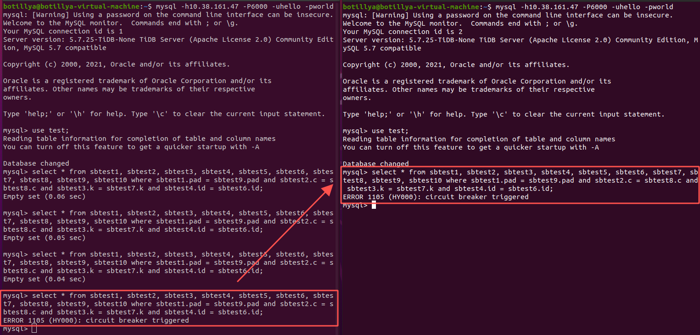

# Weir测试

## 测试环境

**物理机配置：**

|   名称   |                配置                |
| :------: | :--------------------------------: |
|   CPU    | 8核 Intel Xeon Cascadelake@2.60GHz |
|   内存   |                32G                 |
|   硬盘   |            200G + 500G             |
| 文件系统 |                ext4                |

**集群环境：**物理机 + tidb * 2 + tikv * 3 + tipd * 3

|   名称   |          配置           |
| :------: | :---------------------: |
| 操作系统 | CentOS 7.3 Kernel 4.9.2 |
| TiDB版本 |         v5.1.0          |
| 配额限制 |         default         |
| 关键参数 |         default         |

**中间件参数：**

* **Weir：**pool_size = 128，其余均为默认设置

* **Haproxy：**nbproc = 32，**负载均衡策略为 roundrobin 轮询**

  ```
  global
  	chroot		/var/lib/haproxy
  	pidfile		/var/run/haproxy.pid
  	maxconn		4000
  	daemon
  	nbproc		32
  	
  defaults
  	mode				tcp
  	retries				3
  	timeout connect		10s
  	timeout client		10m
  	timeout server		10m
  	
  listen tidb-cluster
  	bind *:3390
  	balance roundrobin
  	server tidb-1 <HOST-IP> check inter 2000 rise 2 fall 3
  	server tidb-2 <HOST-IP> check inter 2000 rise 2 fall 3
  ```

**压测工具：**

* sysbench v1.0.20（oltp-insert）

  ```shell
  # 数据 Prepare(30 * 50万)
  sysbench oltp_common \
  --tables=30 --table_size=500000 \
  --mysql-host=<HOST_IP> --mysql-port=<HOST_PORT> --mysql-db=test_weir_db \
  --mysql-user=<USER> --mysql-password=<PassWd> prepare
  
  # 测试
  sysbench oltp_insert \
  --threads=32 --tables=30 --table_size=500000 \
  --mysql-host=<HOST_IP> --mysql-port=<HOST_PORT> --mysql-db=test_weir_db \
  --mysql-user=<USER> --mysql-password=<PassWd> \
  --time=120 --report-interval=10 run
  ```

* tiup bench  v1.5.3（tpc-c）

  ```shell
  # TPC-C Prepare(warehouses = 16，parts = 16)
  tiup bench tpcc --host=<HOST> --port=<PORT> --threads=32 \
  --user=<USER> --password=<PassWd> \
  --warehouses=16 --parts=16 prepare
  
  # TPC-C Run
  tiup bench tpcc --host=<HOST> --port=<PORT> \
  --user=<USER> --password=<PassWd> --time=180s \
  --threads=32 --warehouses=16 --parts=16 run
  ```

## 功能测试

#### IP 黑名单

==内网IP黑名单设置不起作用==

***

#### SQL 白名单 / 黑名单

1. 只添加黑名单

   ```yaml
   # test_namespace.yaml
   frontend:
     sql_blacklist:
       - sql: "select * from person"
       - sql: "select name from person"
       ...
   ```

   Client 端：

   

   Server 端：

   ```shell
   [2021/07/19 09:57:32.750 +08:00] [ERROR] [conn.go:195] ["command dispatched failed (unknown error)"] [conn=1] [connInfo="id:1, addr:10.231.65.53:65339 status:10, collation:utf8mb4_0900_ai_ci, user:hello"] [command=Query] [status="inTxn:0, autocommit:1"] [sql="select * from person"] [txn_mode=OPTIMISTIC] [err="ERROR 1105 (HY000): statement is denied"] [stack="github.com/tidb-incubator/weir/pkg/proxy/server.(*clientConn).Run\n\t/home/cj/weir/pkg/proxy/server/conn.go:195\ngithub.com/tidb-incubator/weir/pkg/proxy/server.(*Server).onConn\n\t/home/cj/weir/pkg/proxy/server/server.go:180"]
   ```

2. 只添加白名单

   ==无明显作用==

3. 黑白名单同时添加（且内容一致）

   ==黑名单优先==
   
4. 复杂一些的黑名单

   ```yaml
   # test_namespace.yaml
   frontend:
     sql_blacklist:
       - sql: "select name from person"
       - sql: "insert into person values('ddd', 4)"
       - sql: "insert into person(age) values(4)"
       - sql: "update person set age = age + 10"
       - sql: "update person set name = 'eee' where age = 1"
       - sql: "delete from person"
       - sql: "delete from person where age = 1"
       - sql: "drop table person"
   ```

   

***

#### 熔断

1. **熔断器功能测试**，配置如下：

   ```yaml
   # test_namespace.yaml
   breaker:
   	scope: "sql" # 监测级别，有namespace、db、table、sql
   	strategies:
   	  - min_qps: 1
   	    failure_rate_threshold: 0
   	    failure_num: 2
   	    sql_timeout_ms: 10
   	    open_status_durationg_ms: 60000
   	    size: 10
   	    cell_interval_ms: 1000
   ```

   准备 10 * 10000 的数据，然后执行此 sql

   ```sbtest
   select * from sbtest1, sbtest2, sbtest3, sbtest4, sbtest5, sbtest6, sbtest7, sbtest8, sbtest9 where sbtest1.pad = sbtest9.pad and sbtest2.c = sbtest8.c and sbtest3.k = sbtest7.k and sbtest4.id = sbtest6.id;
   ```

   执行结果：该 sql 熔断后，其他 session 也不能执行该 sql（直到 60s 后）

   

2. **其他检测级别的测试**

   * **table：**表 sbtest1 熔断，sbtest2 仍可查询

     

   * **db：**数据库 test 熔断，test_weir_db 仍可查询

     

   * **namespace：**所有数据库均不能查询

     

3. **min_qps及错误率百分比测试**

   写了一个简单的脚本 oltp_test.lua，使超时错误率约为 50%（两个查询一快一慢）：

   ```lua
   require("oltp_common")
   
   function prepare_statements()
   	-- We do not use prepared statements here, but oltp_common.sh expects this
       -- function to be defined
   end
   
   function event()
       local rs
       rs = db_query("SELECT * FROM sbtest1 LIMIT 1")
       rs = db_query("SELECT * FROM sbtest1, sbtest2, sbtest3, sbtest4, sbtest5, sbtest6, sbtest7, sbtest8 WHERE sbtest1.id IN (SELECT id FROM sbtest9) AND sbtest1.pad = sbtest2.pad AND sbtest1.c = sbtest3.c AND sbtest1.k = sbtest4.k AND sbtest1.id = sbtest5.id")
   end
   ```

   * 触发熔断器的情况：

     ```yaml
   breaker:
     	scope: "table" # 注意这里不能是”sql"
     	strategies:
     	  - min_qps: 50
     		failure_rate_threshold: 40 # 设置一个比50低的数
     		failure_num: 0
     		sql_timeout_ms: 50 # sql超时错误的时间
     		open_status_duration_ms: 600000 # 熔断开启后的持续时间
     		size: 10
     		cell_interval_ms: 1000
     ```
     
     

   * 不触发熔断器的情况：

     ```yaml
     breaker:
     	scope: "table"
     	strategies:
     	  - min_qps: 50
     		failure_rate_threshold: 60 # 这里改成一个比50高的数
     		failure_num: 0
     		sql_timeout_ms: 50
     		open_status_duration_ms: 600000
     		size: 10
     		cell_interval_ms: 1000
     ```
     
     

***

#### 限流

> 预先准备：
>
> 1. 向数据库 test 和 test_weir_db 分别添加了 10 × 1万 的数据
> 2. 准备了脚本 oltp_test_limiter1.lua 和 oltp_test_limiter2.lua 分别对表 sbtest1、sbtest2 进行查询
>
> 限流器配置：
>
> ```yaml
> rate_limiter:
>   scope: "table"
>   qps: 10000
> ```

* 先测试不限流情况下的 qps：（limit qps = 10000）

  可以看出，sysbench 开启后，qps 逐渐接近 1100 并稳定下来

  

* 测试 scope = “table” 时的情况：（limit qps = 1100）

  可以看出，qps 接近 1100 后返回了错误 “rate limited”

  

* 测试 scope = "db" 时的情况：（limit qps = 2000）

  可以看出，在第二个 sysbench 程序启动不久后返回了错误

  > 注：经多次测试发现，偶尔会有一边返回错误，另一边正常运行的情况

  

* 测试 scope = "namespace" 时的情况：（limit qps = 2000，第二个程序改为在数据库 test_weir_db 上运行）

  可以看出，在第二个 sysbench 程序启动不久后返回了错误

  

## 性能测试（线程为8 ~ 256，使用 weir / haproxy 分别测试）

#### 测试组一：oltp-insert

> 由于测试使用的是 insert，所以要控制每次 Prepare 后不能连续测太多组，避免数据规模变化带来的影响

| Weir / HaProxy | 线程数 |   qps   |   tps   | 95% latancy |
| :------------: | :----: | :-----: | :-----: | :---------: |
|      Weir      |   8    | 602.02  | 602.02  |    19.65    |
|      Weir      |   16   | 1155.61 | 1155.61 |    20.00    |
|      Weir      |   24   | 1560.36 | 1560.36 |    24.83    |
|      Weir      |   32   | 2147.95 | 2147.95 |    22.69    |
|      Weir      |   48   | 2780.38 | 2780.38 |    26.68    |
|      Weir      |   64   | 3279.76 | 3279.76 |    30.26    |
|      Weir      |   80   | 3737.35 | 3737.35 |    33.72    |
|      Weir      |   96   | 4082.84 | 4082.84 |    35.59    |
|      Weir      |  128   | 4743.46 | 4743.46 |    44.98    |
|      Weir      |  160   | 5080.22 | 5080.22 |    51.94    |
|      Weir      |  192   | 5784.40 | 5784.40 |    54.83    |
|      Weir      |  256   | 6198.24 | 6198.24 |    66.84    |

***

| Weir / HaProxy | 线程数 |   qps   |   tps   | 95% latancy |
| :------------: | :----: | :-----: | :-----: | :---------: |
|    HaProxy     |   8    | 659.20  | 659.20  |    17.01    |
|    HaProxy     |   16   | 1198.08 | 1198.08 |    19.65    |
|    HaProxy     |   24   | 1701.08 | 1701.08 |    21.11    |
|    HaProxy     |   32   | 2235.72 | 2235.72 |    21.89    |
|    HaProxy     |   48   | 2948.36 | 2948.36 |    24.38    |
|    HaProxy     |   64   | 3527.49 | 3527.49 |    28.67    |
|    HaProxy     |   80   | 4013.48 | 4013.48 |    31.37    |
|    HaProxy     |   96   | 4338.55 | 4338.55 |    35.59    |
|    HaProxy     |  128   | 5176.44 | 5176.44 |    41.10    |
|    HaProxy     |  160   | 5905.46 | 5905.46 |    42.61    |
|    HaProxy     |  192   | 6444.81 | 6444.81 |    48.34    |
|    HaProxy     |  256   | 7148.34 | 7148.34 |    61.08    |


***

#### 测试组二：oltp-point-select（曲线最后呈下降趋势是由于机器内存不足，但二者下降趋势相同，所以影响不大）

| Weir / HaProxy | 线程数 |   qps    |   tps    | 95% latancy |
| :------------: | :----: | :------: | :------: | :---------: |
|      Weir      |   8    | 1263.75  | 1263.75  |    8.28     |
|      Weir      |   16   | 2397.46  | 2397.46  |    8.90     |
|      Weir      |   24   | 3461.36  | 3461.36  |    9.91     |
|      Weir      |   32   | 4607.77  | 4607.77  |    10.27    |
|      Weir      |   48   | 5826.71  | 5826.71  |    12.08    |
|      Weir      |   64   | 6984.28  | 6984.28  |    12.98    |
|      Weir      |   80   | 7873.50  | 7873.50  |    16.71    |
|      Weir      |   96   | 8603.14  | 8603.14  |    15.27    |
|      Weir      |  128   | 9992.95  | 9992.95  |    17.95    |
|      Weir      |  160   | 11609.92 | 11609.92 |    18.28    |
|      Weir      |  192   | 12305.19 | 12305.19 |    21.50    |
|      Weir      |  256   | 10607.74 | 10607.74 |    30.26    |

***

| Weir / HaProxy | 线程数 |   qps    |   tps    | 95% latancy |
| :------------: | :----: | :------: | :------: | :---------: |
|    HaProxy     |   8    | 1246.37  | 1246.37  |    8.43     |
|    HaProxy     |   16   | 2446.80  | 2446.80  |    8.90     |
|    HaProxy     |   24   | 3537.68  | 3537.68  |    9.91     |
|    HaProxy     |   32   | 4830.99  | 4830.99  |    9.39     |
|    HaProxy     |   48   | 6128.52  | 6128.52  |    11.24    |
|    HaProxy     |   64   | 7228.29  | 7228.29  |    12.52    |
|    HaProxy     |   80   | 7940.22  | 7940.22  |    16.12    |
|    HaProxy     |   96   | 8798.74  | 8798.75  |    15.00    |
|    HaProxy     |  128   | 11011.15 | 11011.15 |    15.27    |
|    HaProxy     |  160   | 12341.36 | 12341.36 |    17.63    |
|    HaProxy     |  192   | 12529.24 | 12529.24 |    20.74    |
|    HaProxy     |  256   | 11464.05 | 11464.05 |    33.72    |


***

#### 测试组三：oltp-update-index

| Weir / HaProxy | 线程数 |   qps   |   tps   | 95% latancy |
| :------------: | :----: | :-----: | :-----: | :---------: |
|      Weir      |   8    | 637.29  | 637.29  |    17.95    |
|      Weir      |   16   | 1202.89 | 1202.89 |    19.65    |
|      Weir      |   24   | 1568.80 | 1568.80 |    23.52    |
|      Weir      |   32   | 2150.97 | 2150.97 |    22.28    |
|      Weir      |   48   | 2959.34 | 2959.34 |    24.83    |
|      Weir      |   64   | 3620.48 | 3620.48 |    27.66    |
|      Weir      |   80   | 4133.86 | 4133.86 |    31.37    |
|      Weir      |   96   | 4599.36 | 4599.36 |    33.72    |
|      Weir      |  128   | 5696.65 | 5696.65 |    37.56    |
|      Weir      |  160   | 6009.13 | 6009.13 |    41.10    |
|      Weir      |  192   | 6343.95 | 6343.95 |    43.39    |
|      Weir      |  256   | 7086.01 | 7086.01 |    57.87    |

***

| Weir / HaProxy | 线程数 |   qps   |   tps   | 95% latancy |
| :------------: | :----: | :-----: | :-----: | :---------: |
|    HaProxy     |   8    | 687.44  | 687.44  |    16.71    |
|    HaProxy     |   16   | 1179.43 | 1179.43 |    19.65    |
|    HaProxy     |   24   | 1593.37 | 1593.37 |    24.38    |
|    HaProxy     |   32   | 2250.29 | 2250.29 |    21.50    |
|    HaProxy     |   48   | 3022.80 | 3022.80 |    23.95    |
|    HaProxy     |   64   | 3613.75 | 3613.75 |    28.16    |
|    HaProxy     |   80   | 4022.22 | 4022.22 |    31.94    |
|    HaProxy     |   96   | 4531.99 | 4531.99 |    33.72    |
|    HaProxy     |  128   | 5808.85 | 5808.85 |    36.89    |
|    HaProxy     |  160   | 5847.05 | 5847.05 |    45.79    |
|    HaProxy     |  192   | 6402.51 | 6402.51 |    51.02    |
|    HaProxy     |  256   | 7075.85 | 7075.85 |    62.19    |


***

#### 测试组四：oltp-update-non-index

| Weir / HaProxy | 线程数 |   qps   |   tps   | 95% latancy |
| :------------: | :----: | :-----: | :-----: | :---------: |
|      Weir      |   8    | 725.94  | 725.94  |    16.12    |
|      Weir      |   16   | 1255.58 | 1255.58 |    20.00    |
|      Weir      |   24   | 1699.16 | 1699.16 |    22.69    |
|      Weir      |   32   | 2226.67 | 2226.67 |    22.69    |
|      Weir      |   48   | 3021.54 | 3021.54 |    26.20    |
|      Weir      |   64   | 3816.64 | 3816.64 |    26.68    |
|      Weir      |   80   | 4409.30 | 4409.30 |    29.19    |
|      Weir      |   96   | 4908.34 | 4908.34 |    31.37    |
|      Weir      |  128   | 6649.19 | 6649.19 |    31.94    |
|      Weir      |  160   | 7519.33 | 7519.33 |    35.59    |
|      Weir      |  192   | 7838.12 | 7838.12 |    41.10    |
|      Weir      |  256   | 8410.56 | 8410.56 |    49.21    |

***

| Weir / HaProxy | 线程数 |   qps   |   tps   | 95% latancy |
| :------------: | :----: | :-----: | :-----: | :---------: |
|    HaProxy     |   8    | 686.41  | 686.41  |    18.61    |
|    HaProxy     |   16   | 1257.17 | 1257.17 |    20.00    |
|    HaProxy     |   24   | 1817.54 | 1817.54 |    20.37    |
|    HaProxy     |   32   | 2224.55 | 2224.55 |    22.28    |
|    HaProxy     |   48   | 3200.86 | 3200.86 |    23.52    |
|    HaProxy     |   64   | 3842.52 | 3842.52 |    26.20    |
|    HaProxy     |   80   | 4476.88 | 4476.88 |    28.67    |
|    HaProxy     |   96   | 5125.57 | 5125.57 |    31.37    |
|    HaProxy     |  128   | 6376.28 | 6376.28 |    34.95    |
|    HaProxy     |  160   | 7244.14 | 7244.14 |    36.89    |
|    HaProxy     |  192   | 7723.91 | 7723.91 |    41.85    |
|    HaProxy     |  256   | 8862.56 | 8862.56 |    52.89    |


***

#### 测试组五：oltp-read-write

| Weir / HaProxy | 线程数 |   qps   |  tps   | 95% latancy |
| :------------: | :----: | :-----: | :----: | :---------: |
|      Weir      |   8    | 1098.65 | 54.93  |   189.93    |
|      Weir      |   16   | 1164.64 | 58.23  |   646.19    |
|      Weir      |   24   | 1162.64 | 58.13  |   1032.01   |
|      Weir      |   32   | 1314.31 | 65.72  |   1191.92   |
|      Weir      |   48   | 1248.76 | 62.44  |   1708.63   |
|      Weir      |   64   | 1431.42 | 71.57  |   1938.16   |
|      Weir      |   80   | 2316.79 | 155.84 |   1453.01   |
|      Weir      |   96   | 2472.51 | 123.63 |   1589.90   |
|      Weir      |  128   | 2402.69 | 120.13 |   1938.16   |
|      Weir      |  160   | 2564.79 | 128.24 |   2238.47   |
|      Weir      |  192   | 2669.85 | 133.49 |   2632.28   |
|      Weir      |  256   | 2689.24 | 134.46 |   2880.27   |

***

| Weir / HaProxy | 线程数 |   qps   |  tps   | 95% latancy |
| :------------: | :----: | :-----: | :----: | :---------: |
|    HaProxy     |   8    | 982.79  | 49.14  |   215.44    |
|    HaProxy     |   16   | 1094.09 | 54.70  |   669.89    |
|    HaProxy     |   24   | 1438.85 | 71.94  |   861.95    |
|    HaProxy     |   32   | 1269.45 | 63.47  |   1170.65   |
|    HaProxy     |   48   | 1369.85 | 68.49  |   1506.29   |
|    HaProxy     |   64   | 1501.45 | 75.07  |   1739.68   |
|    HaProxy     |   80   | 2524.78 | 126.24 |   1327.91   |
|    HaProxy     |   96   | 2395.33 | 119.77 |   1648.20   |
|    HaProxy     |  128   | 2421.39 | 121.07 |   2009.23   |
|    HaProxy     |  160   | 2578.32 | 128.92 |   2198.52   |
|    HaProxy     |  192   | 2615.21 | 130.76 |   2632.28   |
|    HaProxy     |  256   | 2545.23 | 127.26 |   3639.94   |


***

#### 压测测试：（oltp_read_write，threads = 128，20min）

> 测试组五的曲线有些奇怪（线程64~80的落差是机器内存不足，手动重启造成的），因此在oltp_read_write上进行长时间压测

* haproxy：qps = 2201.07，tps = 110.05，95% = 2449.36 ms

  

  

* weir: qps = 2616.65，tps = 130.83，95% = 2159.29

  

  

## TPC-C测试（warehouses = 16，parts = 16，threads = 32，300s）

* Haproxy：

  ```
  [Summary] DELIVERY - Takes(s): 297.6, Count: 1873, TPM: 377.6, Sum(ms): 880602.2, Avg(ms): 0.3, 50th(ms): 0.5, 90th(ms): 0.5, 95th(ms): 0.5, 99th(ms): 0.5, 99.9th(ms): 0.5, Max(ms): 0.5
  [Summary] DELIVERY_ERR - Takes(s): 297.6, Count: 6, TPM: 1.2, Sum(ms): 1007.1, Avg(ms): 0.3, 50th(ms): 0.5, 90th(ms): 0.5, 95th(ms): 0.5, 99th(ms): 0.5, 99.9th(ms): 0.5, Max(ms): 0.5
  [Summary] NEW_ORDER - Takes(s): 298.7, Count: 21547, TPM: 4328.1, Sum(ms): 4878119.1, Avg(ms): 0.3, 50th(ms): 0.5, 90th(ms): 0.5, 95th(ms): 0.5, 99th(ms): 0.5, 99.9th(ms): 0.5, Max(ms): 0.5
  [Summary] NEW_ORDER_ERR - Takes(s): 298.7, Count: 17, TPM: 3.4, Sum(ms): 1978.4, Avg(ms): 0.3, 50th(ms): 0.5, 90th(ms): 0.5, 95th(ms): 0.5, 99th(ms): 0.5, 99.9th(ms): 0.5, Max(ms): 0.5
  [Summary] ORDER_STATUS - Takes(s): 299.2, Count: 1861, TPM: 373.2, Sum(ms): 106255.5, Avg(ms): 0.3, 50th(ms): 0.5, 90th(ms): 0.5, 95th(ms): 0.5, 99th(ms): 0.5, 99.9th(ms): 0.5, Max(ms): 0.5
  [Summary] PAYMENT - Takes(s): 298.9, Count: 20897, TPM: 4195.4, Sum(ms): 3196664.6, Avg(ms): 0.3, 50th(ms): 0.5, 90th(ms): 0.5, 95th(ms): 0.5, 99th(ms): 0.5, 99.9th(ms): 0.5, Max(ms): 0.5
  [Summary] PAYMENT_ERR - Takes(s): 298.9, Count: 7, TPM: 1.4, Sum(ms): 434.3, Avg(ms): 0.3, 50th(ms): 0.5, 90th(ms): 0.5, 95th(ms): 0.5, 99th(ms): 0.5, 99.9th(ms): 0.5, Max(ms): 0.5
  [Summary] STOCK_LEVEL - Takes(s): 299.1, Count: 1964, TPM: 393.9, Sum(ms): 92208.1, Avg(ms): 0.3, 50th(ms): 0.5, 90th(ms): 0.5, 95th(ms): 0.5, 99th(ms): 0.5, 99.9th(ms): 0.5, Max(ms): 0.5
  tpmC: 4328.1, efficiency: 2103.5%
  ```

* Wier：

  ```
  [Summary] DELIVERY - Takes(s): 298.9, Count: 1762, TPM: 353.6, Sum(ms): 906592.9, Avg(ms): 0.3, 50th(ms): 0.5, 90th(ms): 0.5, 95th(ms): 0.5, 99th(ms): 0.5, 99.9th(ms): 0.5, Max(ms): 0.5
  [Summary] DELIVERY_ERR - Takes(s): 298.9, Count: 4, TPM: 0.8, Sum(ms): 1109.0, Avg(ms): 0.3, 50th(ms): 0.5, 90th(ms): 0.5, 95th(ms): 0.5, 99th(ms): 0.5, 99.9th(ms): 0.5, Max(ms): 0.5
  [Summary] NEW_ORDER - Takes(s): 299.2, Count: 21109, TPM: 4232.5, Sum(ms): 4861361.5, Avg(ms): 0.3, 50th(ms): 0.5, 90th(ms): 0.5, 95th(ms): 0.5, 99th(ms): 0.5, 99.9th(ms): 0.5, Max(ms): 0.5
  [Summary] NEW_ORDER_ERR - Takes(s): 299.2, Count: 14, TPM: 2.8, Sum(ms): 1365.4, Avg(ms): 0.3, 50th(ms): 0.5, 90th(ms): 0.5, 95th(ms): 0.5, 99th(ms): 0.5, 99.9th(ms): 0.5, Max(ms): 0.5
  [Summary] ORDER_STATUS - Takes(s): 299.3, Count: 1864, TPM: 373.6, Sum(ms): 104685.6, Avg(ms): 0.3, 50th(ms): 0.5, 90th(ms): 0.5, 95th(ms): 0.5, 99th(ms): 0.5, 99.9th(ms): 0.5, Max(ms): 0.5
  [Summary] PAYMENT - Takes(s): 299.3, Count: 20142, TPM: 4037.4, Sum(ms): 3261633.5, Avg(ms): 0.3, 50th(ms): 0.5, 90th(ms): 0.5, 95th(ms): 0.5, 99th(ms): 0.5, 99.9th(ms): 0.5, Max(ms): 0.5
  [Summary] PAYMENT_ERR - Takes(s): 299.3, Count: 10, TPM: 2.0, Sum(ms): 961.1, Avg(ms): 0.3, 50th(ms): 0.5, 90th(ms): 0.5, 95th(ms): 0.5, 99th(ms): 0.5, 99.9th(ms): 0.5, Max(ms): 0.5
  [Summary] STOCK_LEVEL - Takes(s): 299.4, Count: 1792, TPM: 359.2, Sum(ms): 85243.9, Avg(ms): 0.3, 50th(ms): 0.5, 90th(ms): 0.5, 95th(ms): 0.5, 99th(ms): 0.5, 99.9th(ms): 0.5, Max(ms): 0.5
  tpmC: 4232.5, efficiency: 2057.0%
  ```

## 性能测试总结

Weir 作为 TiDB 中间件，与使用 Haproxy 均衡负载的性能差别很小（0% ~ 5%），并没有出现明显的波动、性能损耗。除此之外，在性能测试的过程中反而暴露了 Weir 的一些问题（bug / 待完善的地方），接下来可以把更多的心思放在这上面。

